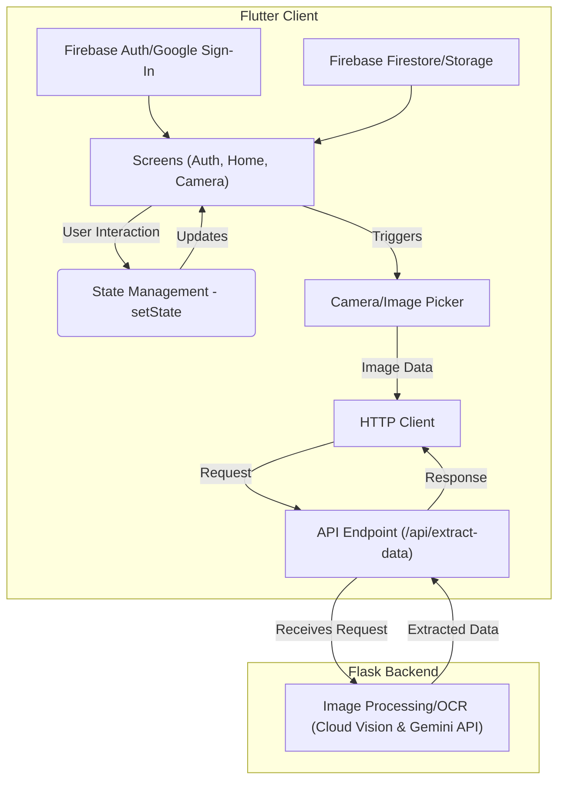

# Flutter LabelScan

[](https://flutter.dev/)
[](https://www.python.org/)
[](https://flask.palletsprojects.com/)
[](https://opensource.org/licenses/MIT)

## 📱 About

Flutter LabelScan is a mobile application that helps shoppers keep track of their shopping cart costs in real-time. Using your phone's camera, simply scan price labels while shopping, and the app will maintain a running total of your expenses, including subtotal, taxes, and final cost.

## ✨ Features

- **Real-time Price Scanning**: Use your camera to scan price labels on products
- **AI-powered OCR Technology**: Automatically extracts price data from scanned labels using Google Vision & Gemini API
- **Running Totals**: Keeps track of subtotal as you shop
- **Tax Calculation**: Automatically calculates taxes based on your location
- **Shopping History**: Save and review past shopping trips
- **Offline Mode**: Works without internet connection for basic functionality

## 🚀 Getting Started

### Prerequisites

- Flutter SDK (version 2.0 or higher)
- Python 3.7+ (for backend)
- Android Studio / Xcode for mobile deployment
- Camera-enabled mobile device for testing

### Installation

1. Clone the repository and navigate to the project directory
   ```bash
   cd flutter-labelscan
   ```

2. Install Flutter dependencies
   ```bash
   flutter pub get
   ```

3. Set up the Python Flask backend
   ```bash
   cd backend
   pip install -r requirements.txt
   ```

4. Start the Flask server locally (in development mode)
   ```bash
   export FLASK_ENV=development FLASK_DEBUG=1 && pip3 install -r ./api/requirements.txt && python3 -m flask --app api/app:create_app run --reload -p 5328
   ```

5. Run the Flutter application:
   ```bash
   flutter run
   ```

## 🛠️ Technologies Used

- **Frontend**: Flutter, Dart
- **Backend**: Python, Flask, Cloud Run, Firebase, Cloud Storage
- **Image Processing / OCR**: Google Vision & Gemini API

## 📊 Architecture

The application follows a client-server architecture:
- Flutter mobile app handles the UI and camera integration
- Flask backend processes images and extracts price information
- RESTful API connects the frontend and backend components

## 📷 Screenshots

*Coming Soon!*

## 📜 License

This project is licensed under the MIT License - see the LICENSE file for details.

## 🤝 Contributing

Contributions are welcome! Please feel free to submit a Pull Request.

1. Fork the Project
2. Create your Feature Branch (`git checkout -b feature/AmazingFeature`)
3. Commit your Changes (`git commit -m 'Add some AmazingFeature'`)
4. Push to the Branch (`git push origin feature/AmazingFeature`)
5. Open a Pull Request

## 🖼️ Architecture Diagram



## 📞 Contact

Project Link: [https://github.com/anthonycoffey/flutter-labelscan](https://github.com/anthonycoffey/flutter-labelscan)

Author: [Anthony Coffey](https://coffey.codes/)

---

Made with ❤️ using Flutter and Python