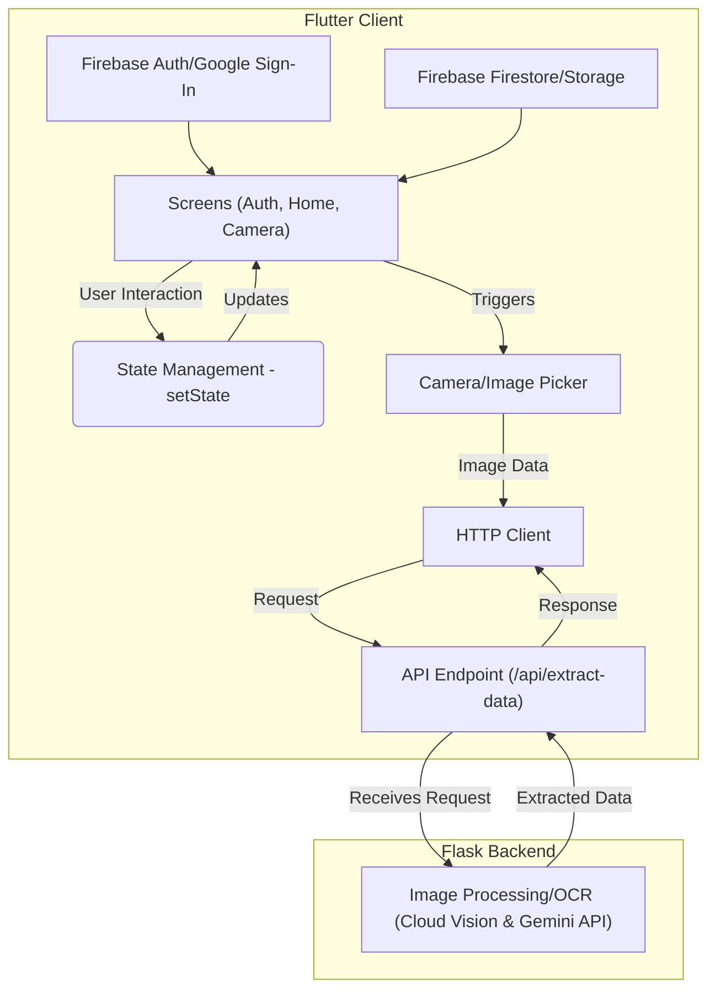

# System Patterns: Flutter LabelScan

## 1. Architecture Overview

*   **Client-Server Architecture:** The system consists of a Flutter mobile application (client) and a Python Flask backend (server).
*   The Flutter app handles the user interface, camera interaction, and communication with the backend.
*   The Flask backend is responsible for processing images (OCR) and potentially other business logic.
*   Communication occurs via a RESTful API.



## 2. Key Technical Decisions & Patterns

*   **State Management:** `flutter_riverpod` and `provider` packages are included. Riverpod is likely the primary solution, potentially with Provider used alongside or as legacy.
*   **Navigation:** Flutter's built-in imperative `Navigator` (`Navigator.push`, `Navigator.pop`) is used for screen transitions.
*   **Data Handling:**
    *   **Authentication:** Firebase Auth with Google Sign-In.
    *   **Data Storage:** Cloud Firestore for structured data, Firebase Storage for image files (likely).
    *   **API Communication:** `http` package used for making REST API calls to the Flask backend.
    *   **Local Files:** `path_provider` used for accessing file system paths (potentially for temporary image storage).
*   **Scanning/OCR:**
    *   **Image Capture:** `camera` and `image_picker` packages used in the Flutter app.
    *   **OCR Processing:** Handled by the Python Flask backend using Google Cloud Vision API for OCR and potentially Google Gemini API for intelligent data extraction from the image. The Flutter app sends the image to the backend.
*   **Error Handling:** Standard enterprise-grade practices expected. In Flutter: Use `try-catch` blocks, provide user feedback via Snackbars/Dialogs for recoverable errors, log critical errors. In Flask: Centralized error handlers, return appropriate HTTP status codes (e.g., 4xx for client errors, 5xx for server errors), log exceptions.
*   **Asynchronous Operations:** Standard Dart `async/await` syntax is used. `FutureBuilder` and `StreamBuilder` are employed for reacting to asynchronous data streams (e.g., camera initialization, auth state changes).

## 3. Component Relationships

*   **Auth Flow:** `AuthWrapper` likely listens to `FirebaseAuth.instance.authStateChanges()` stream. If logged in, shows `HomeScreen`; otherwise, shows `AuthScreen`.
*   **Scanning Flow:** `HomeScreen` likely navigates to `CameraScreen`. `CameraScreen` captures an image using the `camera` package, potentially saves it temporarily using `path_provider`, sends it to the Flask backend via `http`, receives the extracted price, and returns the result (or the image path) back to `HomeScreen` using `Navigator.pop`. `HomeScreen` updates the running total.
*   (*Further details require deeper code analysis.*)

## 4. Critical Implementation Paths

*   **Authentication:** User opens app -> `AuthWrapper` checks auth state -> Redirects to `AuthScreen` -> User signs in (e.g., Google) -> Firebase Auth confirms -> `AuthWrapper` redirects to `HomeScreen`.
*   **Price Scanning:** User on `HomeScreen` taps 'Scan' -> Navigates to `CameraScreen` -> User captures image -> Image sent to Flask backend API -> Backend performs OCR, returns price -> Price received by `CameraScreen` -> `Navigator.pop` returns price to `HomeScreen` -> `HomeScreen` updates total.

## 5. Git Workflow (Feature Branch)

This project follows a standard feature branch workflow:

1.  **Create Feature Branch:** Start new work by creating a branch off `master`:
    ```bash
    git checkout master
    git pull origin master # Ensure master is up-to-date
    git checkout -b feat/<feature-name> # e.g., feat/collapsible-totals
    ```
2.  **Develop & Commit:** Make changes and commit them locally:
    ```bash
    # ... make code changes ...
    git add . # Stage changes
    git commit -m "feat: Describe the feature briefly"
    ```
3.  **Push Branch:** Push the new branch to the remote repository:
    ```bash
    git push -u origin feat/<feature-name>
    ```
4.  **Create Pull Request (PR):** Go to the GitHub repository and create a Pull Request from the feature branch (`feat/<feature-name>`) into the `master` branch.
5.  **Review & Merge:** The PR is reviewed, and once approved, merged into `master` via the GitHub interface.
6.  **Clean Up:** After the PR is merged:
    *   Switch back to the `master` branch and pull the merged changes:
        ```bash
        git checkout master
        git pull origin master
        ```
    *   Delete the local feature branch:
        ```bash
        git branch -d feat/<feature-name>
        ```
    *   Delete the remote feature branch:
        ```bash
        git push origin --delete feat/<feature-name>
        ```
